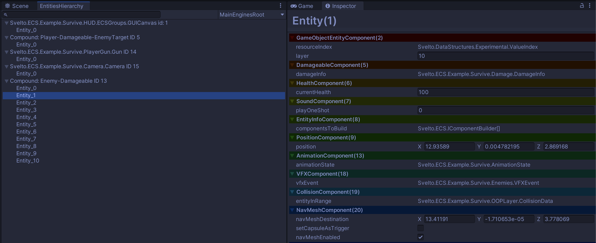

# SveltoECS Unity EntityVisualize
This library displays a list of structure [Svelto.ECS](https://github.com/sebas77/Svelto.ECS) entities and their structure in the Unity Inspector.<br>
*Rewriting values ​​is not supported.

# Requirement
- Unity 2022.1 higher

# Dependency
- [Svelto.ECS](https://www.nuget.org/packages/Svelto.ECS/)
- [Svelto.Common](https://www.nuget.org/packages/Svelto.Common/)

## Git Path (Unity Package Manager)
> https://github.com/kurobon-jp/SveltoECS.Unity.EntityVisualize.git?path=Assets/

## Usage 

### Register EnginesRoot
```csharp
public class MainCompositionRoot : ICompositionRoot
{
    public void OnContextInitialized<T>(T contextHolder)
    {
        var entitySubmissionScheduler = new EntitiesSubmissionScheduler();
        var enginesRoot = new EnginesRoot(entitySubmissionScheduler);
        enginesRoot.AddEngine(new HogeEngine());
        ~
        EntityVisualizer.Register("MainEnginesRoot", enginesRoot);
    }
}
```

Window -> Svelto.ECS -> Entities Hierarchy<br>
